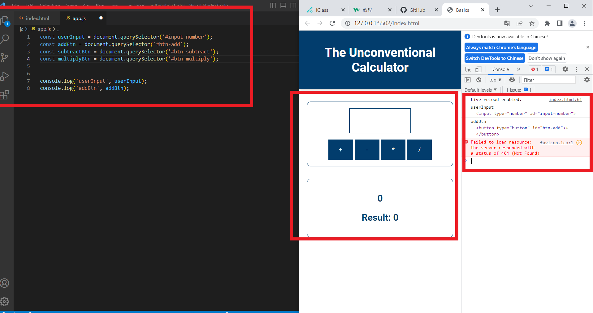
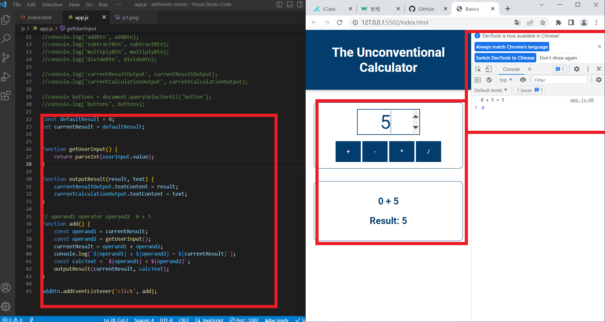
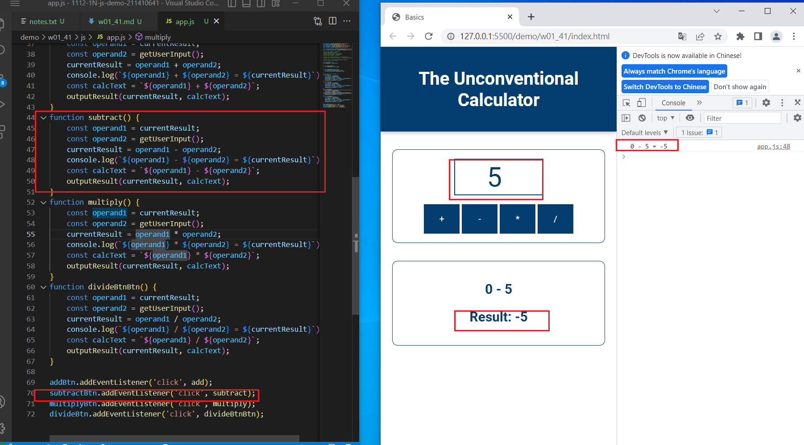
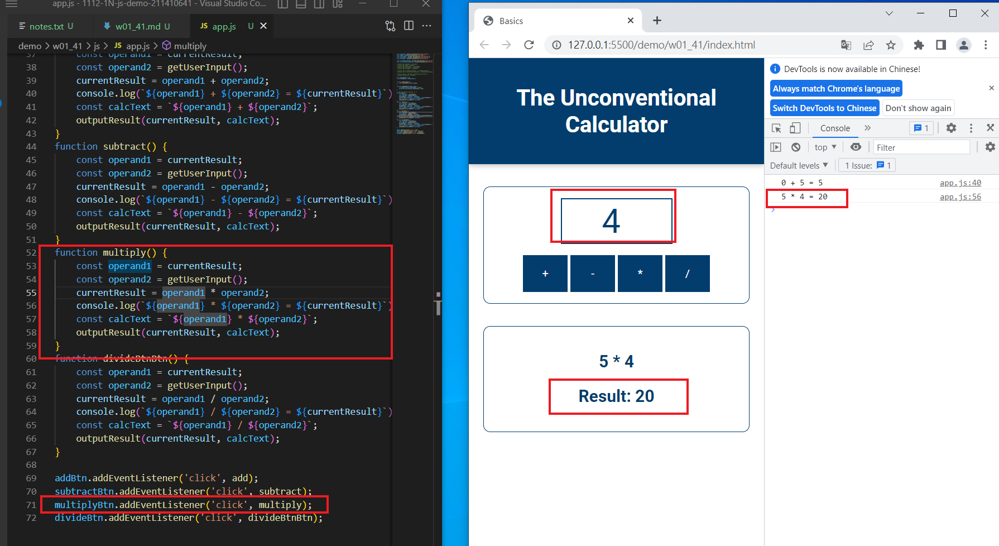
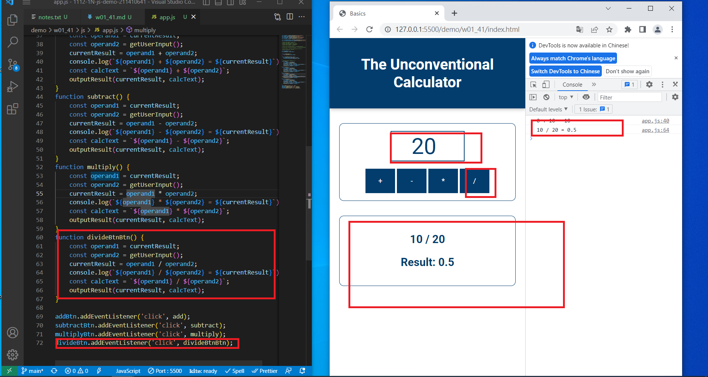
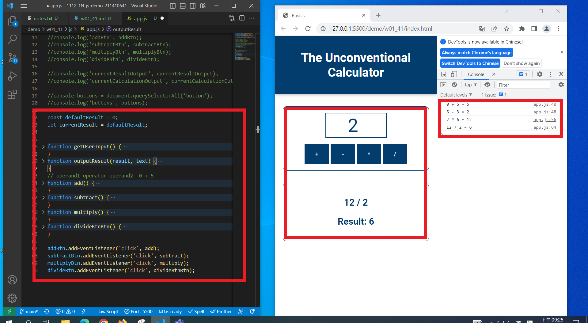

[URL](https://github.com/100peggy/1112-1N-js-demo-211410641/blob/main/demo/md/w01_41/w01_41.md)

### W01-P1: 取得畫面輸入，4 個按鈕，兩個輸出，共 7 個，透過 console.log 印出  

### W01-P2: 能做加法計算  operand1 + operand2 

### W01-P3: 能做減法計算  operand1 - operand2 

### W01-P4: 能做乘法計算  operand1 \* operand2 

### W01-P5: 能做除法計算  operand1 / operand2

### W01-P6: 能做四則計算，加減乘除都要執行一遍，可任意順序，結果要正確

$ git log --pretty=format:"%h%x09%an%x09%ad%x09%s" --after="2023-2-15"
53d9637 100peggy Thu Feb 16 21:27:22 2023 +0800 ### W01-P6: 能做四則計算，加減乘除都要執行一遍，可任意順序，結果要正確 01~
db98037 100peggy Thu Feb 16 20:31:57 2023 +0800 Initial commit
